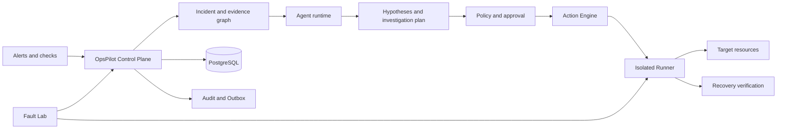

# OpsPilot AI

[](https://github.com/MoMoM101/OpsPilot-AI/actions/workflows/backend.yml)
[](https://github.com/MoMoM101/OpsPilot-AI/actions/workflows/frontend.yml)
[](https://github.com/MoMoM101/OpsPilot-AI/actions/workflows/runner.yml)
[](https://github.com/MoMoM101/OpsPilot-AI/actions/workflows/lab.yml)
[](LICENSE)

**Safety-first agentic AIOps for evidence-grounded incident investigation and policy-governed remediation.**

OpsPilot AI is a self-hosted, open-source control plane for teams that need help investigating
incidents without handing unrestricted infrastructure access to an LLM. It correlates alerts,
resources, observations, evidence, and runbooks; builds auditable hypotheses; and routes every
real change through deterministic policy, approval, idempotency, resource locking, and isolated
Runner boundaries.

> 中文简介：OpsPilot AI 面向缺少专职 SRE 的中小技术团队，提供可私有化部署的故障调查与
> 受控修复 Agent。Agent 负责“调查什么、为什么、下一步是什么”，确定性控制面负责权限、
> 策略、审批、互斥、执行与审计。

> [!IMPORTANT]
> OpsPilot AI is currently pre-1.0 software. Use the included Fault Lab and a non-production
> environment before connecting real infrastructure. The Compose template is intended for local
> development, demos, and single-host validation; it is not a public-internet production topology.

## Why OpsPilot AI?

Traditional automation answers “how do I execute this command?” OpsPilot AI focuses on “what
should I investigate now, what evidence supports the decision, is the change authorized, and did
the system actually recover?”

- **Evidence-grounded investigation** — hypotheses and decisions link back to observations rather
  than relying on model prose alone.
- **Bounded autonomy** — the Agent can adapt its investigation plan but cannot expand its own
  permissions, tools, resources, or approval scope.
- **Policy-governed actions** — approvals are one-time authorizations; execution is idempotent and
  protected by environment scope and resource fencing.
- **Isolated execution** — Runner credentials, capabilities, leases, and fencing tokens stay out of
  the browser control plane.
- **Recovery verification** — a successful command is not treated as a recovered service without
  follow-up verification.
- **Reproducible Fault Lab** — Qdrant, SQLite, embedding, latency, timeout, and backend-failure
  scenarios exercise investigation and audit paths end to end.
- **Private deployment** — control-plane data, credentials, evidence, and model configuration remain
  within the operator's deployment boundary.

## Architecture



The model-facing Agent never becomes the authorization boundary. Environment scope, tool schemas,
resource ownership, policy decisions, approvals, execution limits, fencing, and audit records are
validated by deterministic application services and database constraints.

## Repository layout

| Path | Purpose |
|---|---|
| `backend/` | FastAPI control plane, Agent runtime, Policy/Approval/Action Engine, migrations |
| `frontend/` | React operations console and generated OpenAPI client types |
| `runner/` | Isolated observation and controlled-action execution plane |
| `lab/` | Deterministic Fault Lab services and bounded E2E verifier |
| `docs/` | Architecture, security, operations, recovery, and phased delivery documentation |
| `.github/workflows/` | Backend, frontend, Runner, and Fault Lab quality gates |
| `main.py` | Cross-platform local launcher for Windows, Linux, and macOS |

## Quick start

Requirements:

- Python 3.12 or 3.13;
- Docker Engine or Docker Desktop;
- Docker Compose v2.

From the repository root:

```bash
# Windows
python main.py

# Linux/macOS
python3 main.py
```

The launcher creates missing local-only Compose secret files, builds the images, applies Alembic
migrations, starts PostgreSQL/backend/frontend, and waits for readiness. It never replaces an
existing secret.

Open <http://127.0.0.1:8080>. On first boot, use the value in
`.secrets/control_plane_bootstrap_token` on the `/setup` page to create the first unrestricted user
Admin. The bootstrap token is not a user login token and can only initialize the first Admin.

Useful commands:

```bash
python main.py doctor
python main.py status
python main.py logs --follow
python main.py start --no-build
python main.py stop
```

`stop` preserves database and Runner volumes. `stop --lab --remove-volumes` permanently removes
local Compose data and should only be used for an intentional reset.

## Fault Lab

Start the control plane, Runner, and deterministic lab services:

```bash
python main.py start --lab --no-open
```

The full Lab uses additional memory for Qdrant and the supporting services. A host with at least
4 CPU cores and 8 GiB RAM is recommended for the complete stack. Keep the Lab isolated from real
infrastructure and never use its development tokens on a public deployment.

## Quality gates

The repository enforces:

- pytest, Ruff, and strict MyPy for Backend, Runner, and Fault Lab;
- TypeScript checks, Vitest, OpenAPI drift detection, and a production frontend build;
- a single Alembic migration head plus upgrade/check validation;
- offline Agent evaluation with safety and grounding thresholds;
- Compose validation, container builds, and bounded Fault Lab E2E;
- targeted regressions for environment scope, approvals, resource fencing, prompt injection,
  outbox reliability, backup/restore, and control-plane recovery.

See [the latest Phase 7 acceptance report](docs/Phase7-全量验收报告.md) for the current local
validation status.

## Documentation

- [Architecture and product definition](docs/AIOps-Agent-项目总纲与架构设计.md)
- [Phased implementation and open-source plan](docs/AIOps-Agent-分阶段实施与GitHub开源计划.md)
- [Container deployment](docs/容器化部署.md)
- [Control-plane authentication and RBAC](docs/控制面认证与RBAC.md)
- [Runner deployment and security](docs/Runner部署与安全配置.md)
- [Prompt-injection defenses](docs/Agent-Prompt-Injection防护.md)
- [Backup, restore, and audit archival](docs/备份恢复与审计归档.md)
- [Security policy](SECURITY.md)

## Contributing

Contributions are welcome. Start with [CONTRIBUTING.md](CONTRIBUTING.md), keep changes scoped, add
regression tests for behavior changes, and never include real credentials, customer data, or
production logs in issues or fixtures.

For vulnerabilities, follow [SECURITY.md](SECURITY.md) instead of opening a public issue.

## License

Licensed under the [Apache License 2.0](LICENSE).

