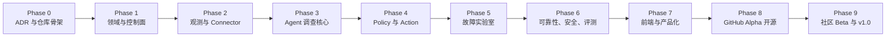

# AIOps Agent 分阶段实施与 GitHub 开源计划

> 产品名称：OpsPilot AI  
> 文档版本：v0.1  
> 日期：2026-08-03  
> 最终交付：GitHub 公共开源仓库、可复现演示环境、版本化 Release 与社区贡献入口

---

## 1. 计划目标

本文档将《AIOps Agent 项目总纲与架构设计》转化为可执行的开发阶段。

目标不是一次完成所有 AIOps 能力，而是依次建立：

```text
架构决策
→ 后端地基
→ 只读观测
→ Agent 自主调查
→ 受控执行
→ 故障实验室
→ 可靠性与安全
→ 产品化与文档
→ GitHub Alpha
→ 社区 Beta
→ v1.0.0
```

每个阶段都包含：

- 阶段目标；
- 开发任务；
- 交付产物；
- 验收门槛；
- 建议 GitHub Epic/Issue；
- 明确暂不处理的内容。

---

## 2. 执行假设

- 一人主导后端架构与核心实现；
- 前端可在 API 和事件协议稳定后，通过其他 AI 平台辅助开发；
- 使用 Python、FastAPI、LangGraph、PydanticAI、PostgreSQL；
- 第一版采用 Docker Compose 私有化部署；
- 第一版监控现有 RAG-ReActAgent 作为真实演示对象；
- 第一版只支持 Linux/Docker、SQLite、Qdrant 和基础日志；
- 先完成单 Agent 闭环，不急于多 Agent；
- 先证明安全调查与受控修复，再扩展 Connector 数量。

### 2.1 周期说明

下列周期是“一人开发并合理使用 AI 编码助手”的粗略规划，不是固定承诺：

| 范围 | 建议周期 |
|---|---:|
| 可公开的 v0.1.0-alpha | 约 12～18 周 |
| 社区可试用的 v0.5.0-beta | Alpha 后约 4～8 周 |
| 稳定 v1.0.0 | Beta 后根据反馈推进 |

任何阶段如果验收门槛未通过，不应仅为了日期进入下一阶段。

---

## 3. 总阶段图



---

## 4. Phase 0：ADR、边界与仓库骨架

### 4.1 阶段目标

在正式编写业务功能前，确定影响整体结构的关键决策，并建立可持续开发的仓库骨架。

### 4.2 必须完成的 ADR

| ADR | 决策主题 | 建议初始选择 |
|---|---|---|
| ADR-001 | 主要数据库 | PostgreSQL；测试可使用临时实例 |
| ADR-002 | Agent 编排 | LangGraph 负责流程和 Checkpoint |
| ADR-003 | 节点内智能 | PydanticAI 负责类型安全 Agent 调用 |
| ADR-004 | 任务执行 | MVP 使用 PostgreSQL 持久任务/Outbox |
| ADR-005 | Runner 模式 | MVP 常驻轻量 Runner；后续 mTLS |
| ADR-006 | Policy | MVP Python + YAML 规则；后续评估 OPA |
| ADR-007 | 日志入口 | Docker、Journalctl、文件日志优先 |
| ADR-008 | 项目许可证 | Apache-2.0 或 MIT 二选一并说明原因 |
| ADR-009 | 模型数据边界 | 默认脱敏；外部模型明确提示外发范围 |
| ADR-010 | Temporal 引入条件 | MVP 不引入，达到分布式长任务条件后评估 |

### 4.3 工程任务

- 初始化 Monorepo；
- 建立 `backend/`、`frontend/`、`runner/`、`docs/`；
- 配置 Python 版本和 `pyproject.toml`；
- 配置 Ruff、Mypy、Pytest；
- 初始化 React + TypeScript 外壳；
- 配置 ESLint/Oxlint、Vitest；
- 创建 Docker Compose 开发环境；
- 添加 `.env.example` 和配置说明；
- 建立 GitHub Actions 基础 CI；
- 建立 Conventional Commits 或简化提交规范；
- 配置 pre-commit 或等价本地质量检查；
- 禁止任何真实凭据进入仓库。

### 4.4 交付产物

```text
docs/adr/ADR-001-*.md ... ADR-010-*.md
backend/
frontend/
runner/
docker-compose.yml
.github/workflows/ci.yml
README.md（项目占位说明）
LICENSE（若已完成决策）
```

### 4.5 验收门槛

- 后端空项目能够启动并返回 `/health`；
- 前端能够构建；
- PostgreSQL 可通过 Compose 启动；
- 后端和前端测试命令可运行；
- CI 在干净环境中通过；
- 十项 ADR 均有状态：Accepted、Proposed 或 Deferred；
- 仓库扫描不到真实密钥。

### 4.6 建议 Epic

```text
EPIC-00 Foundation and ADRs
```

### 4.7 暂不处理

- 不写真实 Agent；
- 不接真实服务器；
- 不设计复杂 UI；
- 不引入 Redis、Temporal、Kubernetes。

---

## 5. Phase 1：领域模型与 FastAPI 控制面

### 5.1 阶段目标

建立独立于 LangGraph 和前端的领域模型，让 Incident、资源、证据、动作和审批具备清晰状态。

### 5.2 领域模型

- Environment；
- Resource 与 ResourceRelation；
- ConnectorInstance；
- RunnerInstance 与 RunnerLease；
- Alert；
- Incident 与 IncidentEvent；
- Hypothesis；
- Evidence；
- IncidentPlan 与 PlanStep；
- ActionRequest 与 ActionExecution；
- Approval；
- PolicyRule；
- AuditEvent；
- ChangeEvent；
- NotificationDelivery。

### 5.3 状态机

实现并测试：

- Incident 状态机；
- PlanStep 状态机；
- Action 状态机；
- Approval 状态机；
- Runner Lease 状态。

### 5.4 FastAPI 任务

- 应用工厂和生命周期管理；
- Pydantic Settings；
- SQLAlchemy 2 异步访问；
- Alembic 迁移；
- 统一错误模型；
- Request ID、Trace ID；
- 基础认证骨架；
- `/health`、`/ready`；
- Resource CRUD；
- Incident CRUD 和时间线；
- OpenAPI 文档；
- SSE 事件协议骨架。

### 5.5 交付产物

- 第一版数据库 Schema；
- 领域状态转换服务；
- FastAPI API；
- Alembic 迁移；
- 统一 `AgentEvent` Schema；
- Domain 和 API 测试。

### 5.6 验收门槛

- 非法状态转换必须拒绝；
- Incident 可以从告警创建并生成时间线；
- 数据库迁移可以从空库执行；
- API 契约测试通过；
- Domain 不直接依赖 FastAPI、LangGraph 或 PydanticAI；
- 日志包含 `trace_id` 和 `incident_id`。

### 5.7 建议 Epic

```text
EPIC-01 Domain and Control Plane
```

---

## 6. Phase 2：检测、观测与只读 Connector

### 6.1 阶段目标

在不允许任何真实变更的前提下，让平台能够接收异常、发现资源、查询指标和日志、形成标准化证据。

### 6.2 检测入口

- Alertmanager Webhook；
- 用户手动创建调查；
- Runner 心跳；
- HTTP/TCP Probe；
- Docker 容器健康；
- 周期巡检任务。

### 6.3 Connector 基础协议

实现：

```text
discover
capabilities
health
collect_metrics
query_logs
investigate
available_actions
verify
```

### 6.4 MVP Connector

- Linux Host 只读信息；
- Docker 容器状态与日志；
- HTTP/TCP Probe；
- Prometheus Query API；
- Alertmanager Webhook；
- Journalctl；
- 指定目录文件日志。

### 6.5 Runner

- Runner 注册；
- 心跳和 Lease；
- 能力协商；
- 任务领取；
- 只读工具执行；
- 输出限长；
- 本地脱敏；
- 任务超时；
- Runner 日志和指标。

### 6.6 Evidence 归一化

所有证据包含：

- Resource ID；
- 时间范围；
- 来源；
- 证据类型；
- 内容或 Artifact 引用；
- 原始内容哈希；
- 脱敏标记；
- 时间可信度；
- 采集状态。

### 6.7 告警处理

- 指纹去重；
- 时间窗口关联；
- 连续失败和恢复条件；
- 维护窗口；
- 父子资源抑制；
- `unknown`、`unobservable`、`degraded` 状态。

### 6.8 验收门槛

- Alertmanager 示例能够创建 Incident；
- Runner 失联不会被误判为目标宕机；
- 可以查看 Docker 状态和限定时间日志；
- 大日志输出会被截断或转为 Artifact；
- 敏感字段被脱敏；
- Connector 契约测试通过；
- 整个阶段不存在写操作工具。

### 6.9 建议 Epic

```text
EPIC-02 Detection, Runner and Read-only Connectors
```

---

## 7. Phase 3：Agent 调查核心

### 7.1 阶段目标

实现能够处理复杂故障的自主调查循环：复杂度路由、Plan-Execute-Replan 和步骤级 ReAct。

### 7.2 LangGraph

实现节点：

```text
load_incident
load_topology
load_recent_changes
classify_complexity
create_plan
select_next_step
run_investigator
assess_evidence
maybe_replan
escalate_or_finish
```

### 7.3 PydanticAI

实现：

- PlannerAgent；
- InvestigatorAgent；
- ReplannerAgent；
- 结构化 Hypothesis；
- 结构化 Plan/PlanStep；
- 结构化 InvestigationResult；
- 模型 Profile；
- Provider Adapter；
- Prompt 和 Schema 版本。

### 7.4 Agent 约束

- 最大调查时长；
- 最大迭代次数；
- 最大 Tool Call 数；
- 相同工具重复限制；
- 无进展检测；
- 证据不足时停止；
- 所有结论关联 Evidence ID；
- 不允许调用写工具；
- 不保存隐藏思维链。

### 7.5 Checkpoint

- PostgreSQL 持久 Checkpoint；
- Stable Thread ID；
- Control Plane 重启恢复；
- 节点幂等；
- 旧版本 Graph 恢复测试；
- 大模型消息和大证据只保存必要引用。

### 7.6 验收门槛

- 简单查询走直接工具；
- 复杂问题可以创建至少三步计划；
- 中间证据冲突时能够 Replan；
- 没有证据时不会虚构根因；
- 重启进程后能够恢复调查；
- 失败节点不会错误重复执行已成功副作用；
- 可在前端/SSE 查看计划、步骤、假设和证据。

### 7.7 建议 Epic

```text
EPIC-03 Agent Investigation Runtime
```

---

## 8. Phase 4：Policy、Human-in-the-loop 与 Action Engine

### 8.1 阶段目标

从“只会调查”升级到“能够在边界内安全行动”。

### 8.2 Policy Engine

- Autonomy Level；
- 风险分级；
- 环境规则；
- 资源范围；
- Tool/Action 白名单；
- 执行次数限制；
- 维护窗口；
- 审批规则；
- Policy Dry Run；
- Policy 决策解释。

### 8.3 Human-in-the-loop

- LangGraph Interrupt；
- 审批创建；
- 批准/拒绝；
- 有限参数编辑；
- 审批有效期；
- 执行前二次校验；
- 审批超时；
- 通知和失败记录；
- 高风险双人审批预留。

### 8.4 Action Engine

- `ActionProposal` 和 `ActionRequest`；
- Idempotency Key；
- Resource Lock；
- Action Dispatcher；
- Runner 派发；
- 状态对账；
- 硬指标验证；
- 回滚/补偿接口；
- `UNKNOWN` 状态；
- 审计先行。

### 8.5 第一批动作

只实现可控、容易验证的动作：

- 重启指定测试容器；
- 重新运行健康检查；
- 重新加载测试环境指定服务；
- 暂停/恢复测试流量探测；
- 不实现任意 Shell。

### 8.6 验收门槛

- 模型只能提出 ActionProposal；
- 未授权动作执行数为 0；
- 审批前不能执行；
- 相同 Idempotency Key 不会重复变更；
- 执行超时后先对账，不能立即重试；
- 高风险动作在审计失败时 Fail Closed；
- 两个 Incident 不能同时修改同一资源；
- 验证失败能够停止、Replan 或人工接管。

### 8.7 建议 Epic

```text
EPIC-04 Policy, Approval and Action Engine
```

---

## 9. Phase 5：RAG-ReActAgent 故障实验室

### 9.1 阶段目标

建立一套任何用户都能本地复现的 Docker 故障环境，证明 Agent 不是概念 Demo。

### 9.2 被监控系统

```text
RAG-ReActAgent
├── FastAPI
├── SQLite
├── Qdrant
├── Embedding Service
├── LLM Mock/Compatible API
└── Docker
```

### 9.3 专属 Connector

- SQLite Health；
- SQLite WAL/锁状态；
- SQLite Integrity Check；
- Qdrant Health；
- Qdrant Collection；
- Qdrant Point Count；
- Qdrant 查询冒烟；
- RAG 业务健康检查。

### 9.4 故障注入

```text
qdrant_down
sqlite_locked
disk_full_simulation
embedding_timeout
backend_500
collection_count_mismatch
runner_disconnect
prometheus_unavailable
```

### 9.5 每个案例必须包含

- 故障背景；
- 注入命令；
- 预期告警；
- 预期调查路径；
- 必须找到的证据；
- 允许动作；
- 禁止动作；
- 恢复标准；
- 清理方法；
- 自动化测试。

### 9.6 验收门槛

- `docker compose up` 可启动实验环境；
- 故障注入可重复、可恢复；
- 至少 5 个案例跑通端到端；
- Agent 能区分“进程在线”和“业务不可用”；
- 每个案例有 Trace、审计和报告；
- 不包含真实客户数据和凭据。

### 9.7 建议 Epic

```text
EPIC-05 Reproducible Incident Lab
```

---

## 10. Phase 6：可靠性、安全与评测

### 10.1 阶段目标

让项目具备公开给他人运行的最低安全与可靠性条件。

### 10.2 可靠性

- 分层重试 Owner；
- 指数退避和抖动；
- Connector 熔断；
- Dead Letter Queue；
- Task Lease 恢复；
- Action 状态对账；
- Checkpoint 恢复；
- PostgreSQL 备份恢复；
- 审计归档；
- 降级模式；
- Control Plane 自监控。

### 10.3 安全

- Prompt Injection 回归集；
- Tool 参数注入测试；
- SSRF 防护；
- Secret Store；
- 日志脱敏；
- RBAC；
- 审批绕过测试；
- 非 Root Runner；
- 依赖漏洞扫描；
- 密钥扫描；
- 威胁模型文档；
- `SECURITY.md`。

### 10.4 Agent Eval

指标：

- 根因准确率；
- 证据召回率；
- 错误引用率；
- 无效 Tool Call；
- Replan 有效率；
- 危险动作建议率；
- 危险动作拦截率；
- 人工升级正确率；
- 成本和延迟；
- 无证据时的停止能力。

### 10.5 CI Release Gate

必须包含：

- Ruff/Mypy/Pytest；
- 前端 Lint/Test/Build；
- Connector Contract；
- Policy Matrix；
- Docker E2E；
- Agent Eval 基线；
- 恢复测试；
- 安全测试；
- Secret Scan；
- 依赖扫描。

### 10.6 验收门槛

- 未授权动作执行为 0；
- 重复写动作执行为 0；
- 核心崩溃恢复用例通过；
- Prompt Injection 不能绕过 Tool/Policy；
- 日志不泄漏测试凭据；
- 质量门禁能够阻止不合格 Release；
- 已知限制公开记录。

### 10.7 建议 Epic

```text
EPIC-06 Reliability, Security and Evaluation
```

---

## 11. Phase 7：React 前端与产品化

### 11.1 阶段目标

将后端能力变成可以理解、操作和演示的 Incident 控制台。

### 11.2 页面

- 登录和环境选择；
- Dashboard；
- 资源拓扑；
- Incident 列表；
- Incident 调查时间线；
- 计划和步骤；
- 假设与证据；
- 实时工具调用；
- 审批卡片；
- Action 执行与验证；
- 日志查询；
- Runner/Connector；
- Policy 设置；
- 审计和安全事件。

### 11.3 前端边界

- 使用后端 OpenAPI 生成或校验 TypeScript 类型；
- 使用统一 SSE 事件，不直接绑定 LangGraph/PydanticAI；
- 所有高风险操作显示影响范围、证据和验证标准；
- 不把聊天框作为唯一交互入口；
- 响应式布局以桌面运维控制台为主。

### 11.4 产品化任务

- 一键启动脚本；
- 首次管理员初始化；
- 模型连接检查；
- Connector 配置向导；
- Demo 数据和故障引导；
- 空状态和错误提示；
- 中文 UI；
- 英文文案预留；
- 截图和演示 GIF。

### 11.5 验收门槛

- 新用户按 README 可在 15 分钟内启动 Demo；
- 可以完整观看一个 Incident 从告警到关闭；
- 审批前能够看见风险、参数、证据和影响；
- 网络断开后页面能恢复 Incident 状态；
- 错误信息不会暴露密钥和堆栈敏感信息；
- 前端构建、测试通过。

### 11.6 建议 Epic

```text
EPIC-07 Frontend and Productization
```

---

## 12. Phase 8：GitHub v0.1.0-alpha 公开开源

### 12.1 阶段目标

将仓库从内部开发状态转换为任何人可查看、运行、报告问题和贡献 Connector 的公共开源项目。

### 12.2 开源文件

GitHub 的社区健康检查会识别 README、LICENSE、CODE_OF_CONDUCT、CONTRIBUTING 等文件，因此 Alpha 前必须完善这些入口。

```text
README.md
README.zh-CN.md 或双语入口
LICENSE
CONTRIBUTING.md
CODE_OF_CONDUCT.md
SECURITY.md
SUPPORT.md
CHANGELOG.md
docs/ARCHITECTURE.md
docs/THREAT_MODEL.md
docs/DEPLOYMENT.md
docs/CONNECTOR_DEVELOPMENT.md
docs/EVALUATION.md
```

### 12.3 GitHub 模板

```text
.github/
├── ISSUE_TEMPLATE/
│   ├── bug_report.yml
│   ├── feature_request.yml
│   ├── connector_request.yml
│   └── config.yml
├── PULL_REQUEST_TEMPLATE.md
├── CODEOWNERS
├── dependabot.yml
├── release.yml
└── workflows/
```

GitHub要求 Issue Template/Issue Form 放在 `.github/ISSUE_TEMPLATE` 才能纳入社区健康检查；贡献规范也会在创建 Issue/PR 时向贡献者展示。

### 12.4 仓库设置

- Public Repository；
- 默认分支保护；
- PR 必须通过 CI；
- 禁止直接推送主分支；
- 启用 Discussions；
- 启用 Dependabot；
- 启用 Secret Scanning/Push Protection（可用时）；
- 配置 Topic：`aiops`、`sre`、`llm-agent`、`incident-response`、`fastapi`；
- 设置仓库描述、Logo 和社交预览图；
- 创建 Roadmap Project；
- 创建 `good first issue` 和 `help wanted` 标签。

### 12.5 Alpha 文档要求

README 首屏必须回答：

1. 它解决什么问题；
2. 与 Shell 脚本和普通 ChatOps 有何不同；
3. 当前能做什么、不能做什么；
4. 怎样在 15 分钟内启动；
5. 怎样运行故障演示；
6. 安全边界是什么；
7. 怎样贡献 Connector；
8. 指标和评测如何复现。

### 12.6 Release

发布：

```text
v0.1.0-alpha.1
```

Release 包含：

- Git Tag；
- Release Notes；
- Docker 镜像标签；
- Compose 配置；
- SBOM（建议）；
- 校验摘要；
- 已知限制；
- 升级/卸载方式；
- Demo 视频或 GIF；
- 反馈和安全报告入口。

GitHub Release 基于 Git Tag，可以附带 Release Notes 和二进制/构建产物，适合向社区交付明确版本。

### 12.7 Alpha 发布门槛

- 一键启动在干净机器验证；
- 至少 5 个故障案例可复现；
- CI 全绿；
- 没有真实凭据、客户数据或受限数据；
- LICENSE 明确；
- SECURITY.md 明确私下报告方式；
- 开源文件齐全；
- Docker 镜像可拉取；
- 已知安全限制明确；
- 不把 Alpha 宣称为生产就绪。

### 12.8 建议 Epic

```text
EPIC-08 Open-source Alpha Release
```

---

## 13. Phase 9：社区 Beta 与 v1.0.0

### 13.1 Alpha 后 30 天目标

- 收集安装失败和兼容问题；
- 修复 Quick Start；
- 建立 FAQ；
- 将重复问题转成文档；
- 至少准备 5 个 `good first issue`；
- 发布 Connector 开发模板；
- 对社区 PR 建立 Review SLA；
- 汇总匿名且不敏感的使用反馈。

### 13.2 Beta 目标

建议版本：

```text
v0.5.0-beta.1
```

Beta 重点：

- MySQL 或 PostgreSQL Connector；
- Loki 或 Zabbix Connector；
- Runner mTLS；
- 飞书/企业微信审批；
- 更强的备份恢复；
- 升级兼容；
- 社区贡献 Connector；
- 安装遥测默认关闭或明确征得同意。

### 13.3 v1.0.0 条件

不以 Star 数作为唯一条件，至少满足：

- 核心 Schema 和 Connector Contract 稳定；
- 支持明确的版本升级路径；
- 至少两个非演示环境完成试用；
- 核心 Incident 恢复和安全测试稳定；
- 文档覆盖部署、升级、故障排查和安全；
- 至少支持两个数据库/依赖类 Connector；
- 有明确的支持版本和安全维护策略；
- 重大已知风险已解决或公开声明；
- Release Gate 可重复运行。

### 13.4 建议 Epic

```text
EPIC-09 Community Beta and 1.0 Readiness
```

---

## 14. GitHub Issue 拆分规范

每个 Issue 建议包含：

```markdown
## 背景
为什么需要这项能力。

## 范围
本 Issue 负责什么。

## 非范围
明确不处理什么。

## 技术方案
涉及的模块、Schema 和接口。

## 验收条件
- [ ] 条件一
- [ ] 条件二

## 测试
需要哪些单元、集成或 E2E 测试。

## 风险
安全、兼容和迁移风险。
```

### 14.1 标签建议

```text
area:agent
area:api
area:action-engine
area:connector
area:frontend
area:runner
area:security
area:observability
type:bug
type:feature
type:docs
type:refactor
priority:p0
priority:p1
priority:p2
good first issue
help wanted
```

---

## 15. Definition of Done

普通开发任务只有满足以下条件才算完成：

- 实现符合领域和架构边界；
- 有测试或明确说明无法自动测试的原因；
- 日志和错误处理完整；
- 不泄漏敏感信息；
- 类型检查和静态检查通过；
- API/Schema 变化已更新文档；
- 必要时包含数据库迁移；
- 向后兼容性已评估；
- CI 通过；
- 验收条件逐项确认。

阶段完成则额外要求：

- 对应 Demo 可运行；
- 关键失败路径已测试；
- 文档和已知限制已更新；
- 没有把未完成内容隐藏在模糊描述中；
- 下一阶段依赖已经明确。

---

## 16. 推荐首批 GitHub Issues

```text
#1  ADR-001: Adopt PostgreSQL as the primary database
#2  ADR-002: LangGraph and PydanticAI responsibility boundaries
#3  Define core domain entities and state machines
#4  Bootstrap FastAPI, SQLAlchemy and Alembic
#5  Define unified AgentEvent and SSE contract
#6  Add structured logging and trace correlation
#7  Define Connector capability contract
#8  Implement Runner registration and heartbeat lease
#9  Implement Docker read-only connector
#10 Implement journalctl/file log connector
#11 Implement Alertmanager webhook ingestion
#12 Implement Incident correlation and deduplication
#13 Implement PydanticAI Planner output schema
#14 Build LangGraph investigation state graph
#15 Add PostgreSQL checkpoint recovery test
#16 Implement Policy decision model
#17 Implement ActionRequest and idempotency
#18 Implement human approval interrupt flow
#19 Create Qdrant incident scenarios
#20 Create SQLite lock incident scenario
```

这些 Issue 可以先在本地计划中维护，仓库公开时再同步到 GitHub。

---

## 17. 最终 GitHub 仓库形态

```text
opspilot/
├── backend/
├── frontend/
├── runner/
├── connectors/
├── incident-lab/
├── docs/
│   ├── adr/
│   ├── architecture/
│   ├── deployment/
│   ├── security/
│   └── evaluation/
├── scripts/
├── examples/
├── .github/
├── docker-compose.yml
├── README.md
├── LICENSE
├── CONTRIBUTING.md
├── CODE_OF_CONDUCT.md
├── SECURITY.md
├── SUPPORT.md
└── CHANGELOG.md
```

---

## 18. 最终交付清单

### 18.1 代码

- FastAPI 控制面；
- LangGraph + PydanticAI Agent；
- PostgreSQL 持久化；
- Runner；
- Connector SDK；
- Policy Engine；
- Action Engine；
- React/TypeScript 控制台；
- Docker Compose。

### 18.2 演示

- 可复现 Incident Lab；
- 至少 5 个故障场景；
- 端到端 Trace；
- 审批和恢复演示；
- 截图、GIF 或短视频。

### 18.3 质量与安全

- CI；
- Agent Eval；
- Docker E2E；
- Prompt Injection 测试；
- 动作幂等与恢复测试；
- Secret Scan；
- Threat Model；
- SECURITY.md。

### 18.4 社区

- 公共 GitHub 仓库；
- 明确开源许可证；
- CONTRIBUTING；
- CODE_OF_CONDUCT；
- Issue/PR 模板；
- Discussions；
- Roadmap；
- Connector 开发文档；
- `good first issue`；
- `v0.1.0-alpha.1` Release。

---

## 19. 开源发布参考

- [GitHub Community Profile](https://docs.github.com/en/communities/setting-up-your-project-for-healthy-contributions/about-community-profiles-for-public-repositories)
- [GitHub Contribution Guidelines](https://docs.github.com/en/communities/setting-up-your-project-for-healthy-contributions/setting-guidelines-for-repository-contributors)
- [GitHub Repository Security Quickstart](https://docs.github.com/en/code-security/getting-started/quickstart-for-securing-your-repository)
- [GitHub Releases](https://docs.github.com/en/repositories/releasing-projects-on-github/managing-releases-in-a-repository)
- [GitHub Repository Customization](https://docs.github.com/en/repositories/managing-your-repositorys-settings-and-features/customizing-your-repository)

---

## 20. 结论

项目不应以“大而全的 AIOps 平台”为第一目标，而应通过连续、可验收的阶段逐步建立可信度：

```text
先把业务事实和状态机做对
→ 再建立安全的只读观测
→ 再让 Agent 自主调查
→ 再加入受控执行
→ 再用可复现故障证明效果
→ 最后满足安全、文档和社区门槛后公开
```

GitHub 开源不是把代码设为 Public 就结束，而是要同时交付：

> 可运行的软件、明确的安全边界、可复现的演示、可信的评测、完整的文档、版本化 Release 和社区贡献入口。

第一公开目标建议定为 `v0.1.0-alpha.1`，明确标注实验性质；经过真实用户和社区反馈后推进 Beta，最终以稳定契约、可升级性和安全门禁作为 `v1.0.0` 的发布条件。
