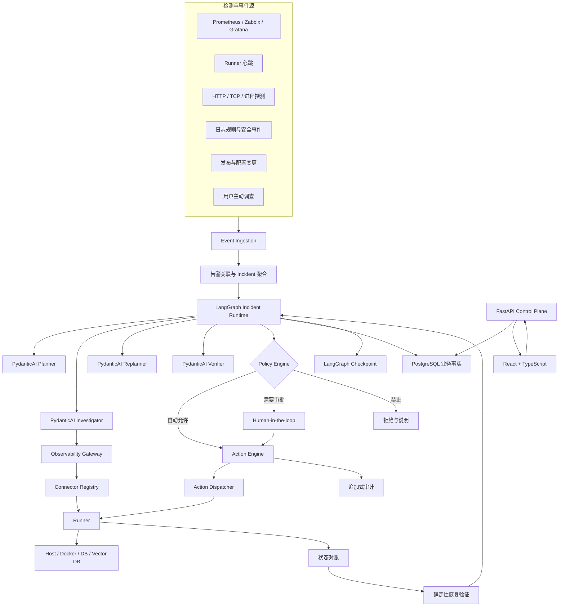
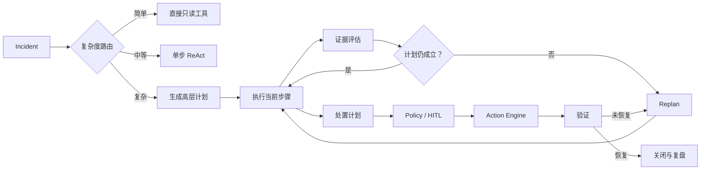

# AIOps Agent 项目总纲与架构设计

> 产品名称：OpsPilot AI  
> 文档状态：Draft v0.1  
> 更新时间：2026-08-03  
> 面向阶段：产品定义、技术选型、MVP 规划与后续开源实施

---

## 1. 文档目的

本文档用于统一项目的产品目标、使用对象、系统边界、核心架构、技术栈、Agent 决策方式、安全执行机制、监控检测、日志审计、兼容方案、可靠性设计、测试评测与分阶段实施计划。

它回答以下问题：

1. 为什么要做这个项目；
2. 项目服务谁，解决什么问题；
3. Agent 相比传统脚本的价值在哪里；
4. 全链路如何从告警走到调查、审批、执行、验证和复盘；
5. LangGraph、PydanticAI、FastAPI、PostgreSQL、Connector 和 Runner 分别服务哪一层；
6. Agent 可以自主决定什么，哪些边界必须由确定性系统控制；
7. 如何支持不同服务器、数据库、向量数据库和监控系统；
8. 出现超时、断连、重复执行、状态未知时如何兜底；
9. MVP 做什么、不做什么，以及如何验证项目价值。

---

## 2. 项目一句话定义

OpsPilot AI 是一个面向缺少专职 SRE 的中小技术团队、支持私有化部署的开源故障调查与受控修复 Agent。

它接收 Prometheus、Zabbix 或周期巡检产生的异常，自动关联指标、日志、资源拓扑、发布变更、数据库状态和 Runbook，形成带证据的根因假设与动态处置计划，并在策略引擎和 Human-in-the-loop 约束下调用现有自动化能力，完成执行、状态对账、恢复验证和事件复盘。

核心表达：

> 脚本解决“怎么执行”，Agent 解决“现在应该调查什么、执行什么、为什么，以及执行后怎么办”。

---

## 3. 产品定位

### 3.1 首要用户

- 20～300 人的软件、互联网或数字化企业；
- 维护约 5～100 台 Linux 服务器；
- 主要使用 Docker、Nginx、MySQL/PostgreSQL、Redis 等常见组件；
- 已有 Prometheus、Zabbix、Grafana 或简单脚本监控；
- 由 1～5 名运维、后端或技术负责人承担值班和故障处理；
- 告警能够发现问题，但调查、判断和修复仍依赖人工经验。

### 3.2 直接使用者

- 运维工程师；
- 后端工程师和技术负责人；
- 值班开发人员；
- 项目交付和驻场工程师；
- 中小团队的兼职 SRE。

### 3.3 次要用户

- IT 服务商；
- 代运维和驻场交付团队；
- 管理多个客户环境的企业服务团队；
- 用于学习和实验的 Homelab 用户。

### 3.4 用户核心痛点

1. 告警来了以后不知道先查哪里；
2. 指标、日志、数据库和发布记录相互割裂；
3. Runbook 分散或依赖少数老员工经验；
4. 新人不敢操作生产系统；
5. 自动化脚本很多，但使用入口、参数和适用条件复杂；
6. 故障处理过程缺乏统一审计和复盘；
7. 私有日志、配置和凭据不能轻易发送到外部 SaaS。

---

## 4. 产品差异化

本项目不定位为新的监控平台，也不以“让大模型执行 Shell”作为卖点。

差异化能力包括：

1. **证据驱动**：所有根因判断必须关联外部指标、日志、配置或状态证据；
2. **动态调查**：Agent 根据中间结果改变假设和调查路径；
3. **有界自治**：Agent 拥有高决策自主性，但不能自行扩大权限；
4. **受控执行**：真实变更必须经过 Policy、审批、幂等、资源锁和对账；
5. **恢复验证**：命令成功不代表故障解决，必须检查业务和技术指标；
6. **私有部署**：支持内网模型、脱敏和本地数据边界；
7. **组件兼容**：通过 Connector 能力发现适配不同基础设施；
8. **可回放与评测**：调查和行动全过程形成结构化 Trace，可复现、可回归。

---

## 5. 非目标与产品边界

### 5.1 MVP 明确不做

- 不重新实现 Prometheus、Zabbix、Loki 或 OpenTelemetry；
- 不提供任意 Shell 自动执行；
- 不直接支持全功能 Kubernetes、多云资源管理和 CMDB；
- 不以完全无人值守的生产修复为默认模式；
- 不在第一阶段实现多租户 SaaS；
- 不同时支持十几种数据库和监控系统；
- 不把多 Agent 角色数量作为卖点；
- 不保存或展示模型隐藏思维链；
- 不允许模型自己修改权限和安全策略。

### 5.2 长期边界

本项目负责故障调查、决策、受控执行与恢复闭环；底层监控、日志存储、工单和配置管理继续由现有系统承担。

---

## 6. 核心设计原则

1. Agent 可以自主判断，但不能自主授权；
2. Agent 可以动态组合工具，但不能执行任意命令；
3. Agent 可以修改调查计划，但不能修改安全策略；
4. Agent 可以提出高风险操作，但必须接受外部审批；
5. 监控负责发现异常，Agent 负责理解和处理异常；
6. PostgreSQL 保存业务事实，Agent Checkpoint 只保存运行游标；
7. 只读查询可以安全重试，变更操作必须先对账再决定是否重试；
8. 所有高风险动作必须先持久化审计记录；
9. 不可观测不等于不健康；
10. 每一个自动动作都必须具有停止条件和验证条件。

---

## 7. 全链路架构



---

## 8. 组件职责映射

| 组件 | 服务的目标 | 核心职责 | 明确不负责 |
|---|---|---|---|
| React + TypeScript | 人机交互 | 资源拓扑、Incident 时间线、证据、审批、日志和策略页面 | Agent 推理 |
| FastAPI | 控制面 | API、认证、资源管理、Webhook、SSE、审批接口 | 直接执行运维命令 |
| LangGraph | 长流程编排 | 状态图、Checkpoint、路由、暂停恢复、HITL | 业务事实唯一存储、危险动作执行 |
| PydanticAI | 节点内智能 | 模型抽象、类型安全输出、Tool 调用、Planner/Investigator/Eval | 整体 Incident 生命周期 |
| PostgreSQL | 事实存储 | 资源、Incident、证据、动作、审批、审计、Checkpoint | 模型推理 |
| Policy Engine | 权限边界 | 风险、资源范围、审批、次数、维护窗口 | 根因判断 |
| Action Engine | 可靠执行 | 幂等、资源锁、派发、对账、验证、补偿 | 自主推理 |
| Connector Registry | 兼容层 | 能力发现、Schema、适配器注册与版本 | 统一抹平所有组件差异 |
| Runner | 目标网络执行面 | 心跳、探测、只读采集、受控动作、脱敏 | 决定做什么、调用 LLM |
| Observability Gateway | 观测统一 | 指标、日志、Trace、证据归一化 | 重新实现监控存储 |
| OpenTelemetry/Prometheus | 平台可观测性 | 指标、Trace、日志传输与告警 | Agent 决策 |

---

## 9. Agent 核心架构

### 9.1 总体模式

采用：

> 复杂度路由 + Plan-Execute-Replan + 步骤级 ReAct + 独立 Action Engine



### 9.2 复杂度路由

| 请求 | 执行方式 |
|---|---|
| 查询一个服务是否在线 | 直接工具调用 |
| 查询指定时间日志 | 单步 ReAct |
| 固定巡检 Runbook | 确定性工作流 |
| 多服务、根因未知 | Plan-Execute-Replan |
| 涉及变更 | Plan + Policy + HITL + Action Engine |

### 9.3 PydanticAI Agent 角色

- **PlannerAgent**：生成高层调查计划和完成标准；
- **InvestigatorAgent**：在单个步骤内选择只读工具、收集证据；
- **ReplannerAgent**：根据冲突证据、工具失败或新信息修改计划；
- **RemediationPlannerAgent**：只生成结构化 ActionProposal；
- **VerifierAgent**：结合硬指标判断恢复、缓解或恶化。

MVP 可以将这些角色作为同一模型配置下的不同 Prompt/Profile，不必运行多个并发 Agent。

### 9.4 LangGraph 节点

```text
ingest_incident
load_context
classify_complexity
create_plan
select_next_step
run_investigator
assess_result
maybe_replan
create_remediation_plan
evaluate_policy
wait_for_approval
create_action_request
wait_for_action_result
reconcile_action
verify_recovery
reflect
close_or_continue
```

### 9.5 责任唯一原则

- LangGraph 负责流程 Checkpoint 和 HITL；
- PydanticAI 负责模型请求、结构化输出和节点内 Tool 调用；
- Policy Engine 负责权限判定；
- Action Engine 负责真实变更；
- 不允许两个框架同时管理同一份审批、重试或持久状态。

---

## 10. Agent 状态与计划模型

### 10.1 计划步骤

```python
class PlanStep(BaseModel):
    id: str
    objective: str
    step_type: Literal[
        "observe", "analyze", "experiment",
        "remediate", "verify", "human"
    ]
    dependencies: list[str]
    resource_scope: list[str]
    allowed_capabilities: list[str]
    expected_evidence: list[str]
    success_criteria: list[str]
    risk: Literal["read_only", "low", "medium", "high"]
    status: Literal[
        "pending", "running", "completed",
        "failed", "skipped", "blocked"
    ]
    attempts: int = 0
    evidence_ids: list[str] = []
    result_summary: str | None = None
```

### 10.2 计划版本

```python
class IncidentPlan(BaseModel):
    schema_version: int
    plan_id: str
    incident_id: str
    version: int
    objective: str
    hypotheses: list[Hypothesis]
    steps: list[PlanStep]
    max_tool_calls: int
    max_duration_seconds: int
    replan_count: int
    status: str
```

### 10.3 Replan 触发条件

- 当前步骤失败或阻塞；
- 没找到预期证据；
- 出现与原假设冲突的证据；
- 出现更高优先级风险；
- Connector 或工具不可用；
- 资源范围或维护状态改变；
- Policy 拒绝原计划；
- 修复失败或验证未通过；
- 连续多轮无新增证据；
- 用户补充新信息。

---

## 11. Incident 生命周期

```text
DETECTED
→ CORRELATING
→ INVESTIGATING
→ DIAGNOSED
→ PLANNING
→ WAITING_APPROVAL
→ REMEDIATING
→ VERIFYING
→ RESOLVED
→ CLOSED
```

异常状态：

```text
OBSERVABILITY_LOST
NEEDS_HUMAN
MITIGATED_NOT_RESOLVED
FAILED
CANCELLED
```

暂时缓解与根因解决必须分开记录。

---

## 12. 检测、指标与心跳

### 12.1 检测职责

确定性监控负责持续检测，LLM 不参与高频轮询。

检测入口：

- Alertmanager/Zabbix/Grafana Webhook；
- Runner 周期巡检；
- HTTP/TCP/进程/容器健康；
- 日志规则与安全事件；
- 发布和配置变更；
- 用户主动发起调查。

### 12.2 检测层级

| 层级 | 示例 |
|---|---|
| Runner | 在线、版本、任务队列、能力 |
| Host | CPU、内存、磁盘、网络、进程 |
| Service | 容器、端口、HTTP、数据库连接 |
| Dependency | MySQL、Qdrant、Embedding、LLM |
| Business | 错误率、延迟、积压、RAG 冒烟问答 |

### 12.3 心跳分类

1. Runner 心跳：默认 15～30 秒；
2. 目标资源探测：Prometheus `up`、HTTP、TCP、Docker Health；
3. Agent 任务 Lease：最近 Checkpoint、工具调用和审批状态；
4. 业务心跳：验证业务功能是否真正可用。

Runner 失联时标记 `observability_lost`，冻结写操作，不能直接断定目标宕机。

### 12.4 防误报

- 连续失败次数；
- 持续时间；
- 恢复连续成功次数；
- 滞回阈值；
- 冷却时间；
- 维护窗口；
- 告警去重；
- 依赖抑制；
- 父子事件聚合。

---

## 13. 资源拓扑与变更事件

### 13.1 轻量资源拓扑

```text
Environment
└── Host
    └── Runtime / Docker
        ├── Application
        │   ├── Database
        │   ├── Vector Database
        │   └── External API
        └── Reverse Proxy
```

资源记录：

- 环境、负责人和重要等级；
- 上下游依赖；
- Connector 和能力；
- 允许动作；
- 健康检查；
- 维护窗口；
- Runbook；
- 凭据引用；
- 当前版本和配置指纹。

### 13.2 变更事件

必须记录并纳入 Agent 上下文：

- 应用发布和镜像变化；
- 配置修改；
- 数据库迁移；
- 扩缩容；
- 密钥轮换；
- Connector/Runner 升级；
- 人工运维操作。

---

## 14. Connector 兼容体系

### 14.1 接口

```python
class ResourceConnector(Protocol):
    async def discover(self): ...
    async def capabilities(self): ...
    async def health(self): ...
    async def collect_metrics(self): ...
    async def query_logs(self): ...
    async def investigate(self, query): ...
    async def available_actions(self): ...
    async def execute(self, action): ...
    async def verify(self, action): ...
```

### 14.2 能力协商

```yaml
connector: qdrant
contract_version: "1.0"
capabilities:
  observe:
    - health
    - collections
    - cluster_peers
    - indexing_status
    - query_latency
  actions:
    - restart_peer
unsupported:
  - sql_query
  - transaction_lock
```

Agent 只能看到 Connector 实际声明的能力。

### 14.3 数据库差异

统一基础能力：

```text
database.health
database.query_smoke
database.storage
database.backup_status
```

专属能力：

```text
mysql.connections
mysql.replication
mysql.innodb_locks
postgres.sessions
postgres.vacuum
sqlite.integrity_check
sqlite.wal_status
sqlite.file_lock
qdrant.collection_status
qdrant.cluster_peers
chroma.heartbeat
```

### 14.4 Connector 路线

MVP：

- Linux Host；
- Docker；
- Prometheus/Alertmanager；
- Journalctl/文件日志；
- HTTP/TCP Probe；
- SQLite；
- Qdrant。

第二阶段：

- MySQL/PostgreSQL；
- Redis；
- Chroma；
- Loki；
- Zabbix；
- OpenTelemetry/OTLP。

---

## 15. Policy 与 Human-in-the-loop

### 15.1 自主等级

| 等级 | 权限 | 示例 |
|---|---|---|
| L0 | 只建议 | 生产保守模式 |
| L1 | 调查自治 | 指标、日志、配置、发布记录 |
| L2 | 有界执行 | 测试环境重启单容器 |
| L3 | 条件自治 | 单实例摘流、满足条件后回滚 |
| L4 | 完全自治 | 不提供默认支持 |

### 15.2 风险等级

| 风险 | 示例 | 默认处理 |
|---|---|---|
| 只读 | 查询日志、指标、状态 | 自动 |
| 低风险 | HTTP Probe、测试环境冒烟 | 自动或通知 |
| 中风险 | 重启单实例、清理指定临时目录 | 审批或预授权 |
| 高风险 | 回滚生产、Kill 连接、配置变更 | 强制审批 |
| 禁止 | 删除数据库、绕过权限 | 拒绝 |

### 15.3 Autonomy Envelope

每个 Incident 都需要资源范围、允许能力、预算、审批规则和禁止项。Agent 可以在边界内自由调查，但不能自行扩大边界。

### 15.4 审批逻辑

- 支持批准、拒绝和有限编辑；
- 审批具有有效期；
- 执行前重新校验资源状态和前置条件；
- 审批超时默认取消；
- 高风险动作可配置双人审批；
- 通知失败时使用备用渠道；
- 审计存储失败时禁止高风险执行。

---

## 16. Action Engine

### 16.1 动作状态机

```text
PROPOSED
→ AUTHORIZED
→ DISPATCHING
→ APPLIED
→ VERIFYING
→ SUCCEEDED
```

异常分支：

```text
DISPATCHING → UNKNOWN
APPLIED → VERIFICATION_FAILED
VERIFICATION_FAILED → COMPENSATING
COMPENSATING → COMPENSATED / ESCALATED
```

### 16.2 动作契约

每个动作包含：

- Action ID 和 idempotency key；
- 目标资源；
- 参数 Schema；
- 风险等级；
- 前置条件；
- 预期副作用；
- 审批要求；
- 超时；
- 验证指标；
- 回滚或补偿方案；
- 最大执行次数。

### 16.3 并发控制

- Incident Lock：防止重复调查；
- Resource Lock：防止同时修改一个资源；
- Action Lock：防止重复动作；
- 执行前再次校验资源版本和审批有效期。

---

## 17. 重试、兜底和熔断

### 17.1 可自动重试

- 指标、日志只读查询超时；
- LLM 429/5xx；
- Runner 短暂网络故障；
- 幂等健康检查；
- 只读数据库查询。

采用指数退避、随机抖动、最大次数和总 Deadline。

### 17.2 不允许盲目重试

- 重启服务；
- 回滚版本；
- Kill 数据库连接；
- 修改配置；
- 清理文件；
- 主从切换。

动作超时后进入 `UNKNOWN`，必须先对账目标状态。

### 17.3 分层重试 Owner

| 层级 | 只负责 |
|---|---|
| PydanticAI | 模型请求和结构化输出修复 |
| LangGraph | 只读节点流程重试 |
| Connector | 网络瞬时故障 |
| Action Engine | 对账后决定动作重试 |

### 17.4 降级矩阵

| 故障 | 降级处理 |
|---|---|
| Prometheus 不可用 | Runner 快照；标记指标证据缺失 |
| Loki 不可用 | Journalctl/Docker/文件日志 |
| LLM 不可用 | 同模型有限重试、备用模型、人工接管 |
| Qdrant 不可用 | Runbook 退化为 BM25/本地文本 |
| Runner 失联 | 冻结写操作，保留现场 |
| Connector 不兼容 | 通用健康检查，降低能力 |
| Agent 进程重启 | 从 Checkpoint 恢复 |
| 审批超时 | 取消或升级，绝不自动通过 |
| 修复后恶化 | 停止原方案、回滚、升级事件 |

### 17.5 熔断与隔离

- Connector 连续失败后短时熔断；
- 单一模型供应商故障不拖垮控制面；
- 每个 Runner、资源和租户设置并发隔离；
- 大日志查询和慢数据库查询设置独立预算；
- Dead Letter Queue 保存无法自动恢复的任务。

---

## 18. 日志、Trace 与审计

### 18.1 日志类型

1. 目标系统日志；
2. 平台运行日志；
3. Agent 结构化决策日志；
4. 工具和动作执行日志；
5. 追加式审计日志；
6. 安全事件日志。

### 18.2 目标日志策略

目标日志默认保留在原系统，Agent 按 Incident 时间窗口查询。平台只保存最终使用的证据片段、来源、时间、哈希和脱敏标记。

### 18.3 统一关联字段

```text
trace_id
incident_id
task_id
action_id
runner_id
resource_id
connector_id
user_id
approval_id
```

### 18.4 Agent 决策日志

保存结构化决策摘要，不保存隐藏思维链：

- 假设及置信度变化；
- 支持与反对证据；
- 工具选择理由摘要；
- 放弃方向；
- Replan 原因；
- 停止或升级人工的原因。

### 18.5 日志安全

- Runner 本地脱敏；
- Token、Cookie、连接串、私钥不进入 Prompt；
- stdout/stderr 限长和二进制过滤；
- 大输出转为受控附件；
- 高风险动作执行前审计必须持久化；
- 日志轮转、保留和删除策略可配置。

---

## 19. 安全与威胁模型

### 19.1 主要威胁

- 日志或 Runbook 中的 Prompt Injection；
- LLM 生成未授权动作；
- 凭据泄漏进 Prompt、日志或 Trace；
- Connector 供应链风险；
- Runner 被冒充或重放请求；
- 审批绕过；
- SSRF 和内网扫描；
- 任意命令和参数注入；
- 重复动作造成服务雪崩；
- 模型供应商外发敏感数据；
- 审计日志被删除或修改。

### 19.2 安全控制

- 日志、文档和工具结果全部视为不可信数据；
- Prompt 与证据数据分层，不允许证据覆盖系统指令；
- Tool Schema、参数白名单和资源范围校验；
- 不提供通用 `run_shell` 给模型；
- Runner 使用专用非 Root 账号；
- Secret Store 保存凭据引用；
- Runner 后续使用 mTLS 和短期 Token；
- 外部模型请求前脱敏并记录数据边界；
- RBAC、环境隔离和最小权限；
- 高风险动作 Fail Closed。

---

## 20. 数据模型

核心表建议：

```text
users
roles
environments
resources
resource_relations
connector_instances
runner_instances
runner_leases
alerts
incidents
incident_events
hypotheses
evidence
plans
plan_steps
action_requests
action_executions
approvals
resource_locks
runbooks
change_events
audit_events
model_profiles
policy_rules
notification_deliveries
```

业务表是事实来源；LangGraph Checkpoint 是运行游标，不能替代业务表。

### 20.1 数据生命周期

- 平台日志默认 30 天；
- Agent Trace 默认 90 天；
- Incident 证据默认 180 天；
- 审计默认 365 天或由组织策略决定；
- 支持清理、归档、备份和恢复；
- 记录 Schema、Graph、Agent Profile 和 Tool Contract 版本。

---

## 21. 模型治理

- 模型配置与业务逻辑分离；
- 支持 OpenAI-compatible、本地 Ollama/vLLM 等接口；
- 每类 Agent 使用独立 Model Profile；
- 当前 Incident 尽量固定模型版本；
- 模型切换后重新验证结构化计划；
- 备用模型不能获得更高权限；
- 记录模型、参数、Prompt 版本、Token、延迟和成本；
- 设置每 Incident 成本、时间和 Tool Call 预算；
- 评测通过后才能升级默认模型。

---

## 22. FastAPI API 与实时事件

### 22.1 API

```text
POST /api/alerts/webhook
GET  /api/incidents
GET  /api/incidents/{id}
GET  /api/incidents/{id}/timeline
GET  /api/incidents/{id}/stream
POST /api/incidents/{id}/investigate
POST /api/approvals/{id}/decision
GET  /api/actions/{id}
GET  /api/resources
POST /api/runners/heartbeat
POST /api/runners/{id}/results
GET  /api/connectors
GET  /api/policies
```

### 22.2 统一事件协议

```text
incident.created
incident.correlated
plan.created
plan.updated
step.started
tool.started
tool.completed
hypothesis.updated
evidence.added
approval.requested
approval.resolved
action.started
action.reconciled
verification.completed
incident.resolved
incident.escalated
```

第一版使用 SSE；前端不直接依赖 LangGraph 或 PydanticAI 原生事件格式。

---

## 23. 前端设计范围

React + TypeScript 前端主要是 Incident 操作台，不以聊天框为中心。

核心页面：

- 总览与平台健康；
- 资源拓扑；
- Incident 列表；
- 调查时间线；
- 当前计划和步骤；
- 假设、证据和置信度；
- 实时工具调用；
- 待审批动作；
- 执行、对账和恢复验证；
- 日志查询；
- Runner 与 Connector 状态；
- Policy 与自主等级；
- 审计与安全事件。

---

## 24. 平台自身可观测性与 SLO

### 24.1 自身指标

```text
runner_online_total
runner_heartbeat_lag_seconds
incident_ingest_latency_seconds
incident_active_total
agent_iteration_total
agent_no_progress_total
llm_request_latency_seconds
llm_error_total
tool_call_total
tool_error_total
action_unknown_total
approval_wait_seconds
connector_error_total
checkpoint_recovery_total
audit_write_error_total
notification_delivery_error_total
```

### 24.2 初始 SLO 建议

| 指标 | MVP 目标 |
|---|---:|
| 告警接收成功率 | ≥ 99.5% |
| Webhook 到 Incident 创建 P95 | ≤ 5 秒 |
| Runner 心跳离线识别 | ≤ 90 秒 |
| 只读工具成功率 | ≥ 95% |
| 高风险未授权执行 | 0 |
| 重复变更执行 | 0 |
| 审计覆盖率 | 100% |
| 崩溃后任务恢复 | 关键测试 100% |

---

## 25. 测试与评测体系

### 25.1 确定性测试

- Domain 单元测试；
- Connector 契约测试；
- Policy 决策矩阵；
- Action 幂等和资源锁；
- 审批过期和并发；
- Checkpoint 恢复；
- 日志脱敏；
- Prompt Injection 防护；
- API 和 SSE 契约；
- 数据迁移和备份恢复。

### 25.2 Agent Eval

- 根因判断准确率；
- 有效证据召回率；
- 错误证据引用率；
- 危险动作建议率；
- 危险动作拦截率；
- 无效 Tool Call 数量；
- Replan 有效率；
- 人工升级正确率；
- Token、延迟和成本；
- 不可回答/证据不足时的停止能力。

### 25.3 故障演练

- Qdrant 停止；
- SQLite 锁等待；
- 磁盘空间不足；
- Embedding 接口超时；
- FastAPI 存活但业务接口 500；
- Runner 断连；
- Prometheus 不可用；
- 动作执行结果未知；
- 审批期间服务状态变化；
- Control Plane 中途重启。

### 25.4 发布门禁

- 静态检查、类型检查和测试通过；
- Agent 回归集不低于质量阈值；
- 安全策略测试 100% 通过；
- Docker E2E 通过；
- 恢复和幂等测试通过；
- 依赖和密钥扫描通过。

---

## 26. MVP 示范场景

首个被监控业务建议直接使用现有 RAG-ReActAgent：

```text
RAG-ReActAgent
├── FastAPI
├── SQLite
├── Qdrant
├── Docker
├── Embedding Service
└── LLM Service
```

第一批故障：

1. Qdrant 停止导致检索失败；
2. SQLite 被长事务锁住；
3. 磁盘不足导致文档入库失败；
4. Embedding 服务超时；
5. FastAPI 在线但问答接口持续 500；
6. Qdrant 在线但 Collection 向量数量异常。

项目必须能区分“进程在线”和“业务真正可用”。

---

## 27. MVP 验收标准

1. Docker Compose 一键启动控制面、Runner 和演示环境；
2. 能通过 Webhook 或巡检创建 Incident；
3. 能关联告警、资源拓扑和最近变更；
4. Agent 能自主生成计划并选择只读工具；
5. 每个结论都有证据引用；
6. 低风险动作可在策略内自动执行；
7. 高风险动作必须等待审批；
8. 变更操作不会盲目重试；
9. Control Plane 重启后任务可恢复；
10. 修复后有连续采样验证；
11. 无法解决时能生成完整人工接管包；
12. 全链路具有结构化日志、Trace 和审计。

---

## 28. 分阶段路线图

### Phase 0：架构骨架

- Domain 数据模型；
- PostgreSQL 和 Alembic；
- FastAPI 控制面；
- LangGraph + PydanticAI 最小闭环；
- 统一事件协议；
- 结构化日志和 Trace ID。

### Phase 1：只读调查 MVP

- Host、Docker、HTTP、日志 Connector；
- Prometheus/Alertmanager；
- Planner、Investigator、Replanner；
- Incident 时间线和证据；
- RAG-ReActAgent 故障实验室。

### Phase 2：受控执行

- Policy Engine；
- Action Engine；
- Human-in-the-loop；
- 幂等、资源锁、对账和验证；
- SQLite、Qdrant 专属诊断。

### Phase 3：可靠性与开源发布

- 崩溃恢复；
- 降级、熔断和 DLQ；
- 审计、安全测试和 Prompt Injection 防护；
- Agent Eval 与 Chaos 测试；
- 文档、贡献指南和演示视频。

### Phase 4：生态扩展

- MySQL/PostgreSQL、Redis、Chroma；
- Loki/Zabbix/OpenTelemetry；
- 飞书/企业微信审批；
- 分布式 Runner 和 mTLS；
- Temporal 可行性评估；
- Kubernetes 和多环境管理。

---

## 29. 推荐后端目录

```text
backend/
├── app/
│   ├── api/
│   ├── domain/
│   │   ├── incidents/
│   │   ├── resources/
│   │   ├── evidence/
│   │   ├── actions/
│   │   ├── approvals/
│   │   └── policies/
│   ├── agent/
│   │   ├── graph.py
│   │   ├── state.py
│   │   ├── nodes/
│   │   ├── agents/
│   │   ├── prompts/
│   │   └── evaluators/
│   ├── action_engine/
│   ├── connectors/
│   ├── observability/
│   ├── policy/
│   ├── runners/
│   ├── security/
│   ├── storage/
│   └── workers/
├── migrations/
├── tests/
├── pyproject.toml
└── Dockerfile
```

依赖方向：

```text
Domain 不依赖 FastAPI
Domain 不依赖 LangGraph
Agent 不直接执行系统命令
Connector 不决定审批
Runner 不调用 LLM
Policy 不依赖模型判断
```

---

## 30. 版本兼容与升级

- 使用 Lock 文件固定 LangGraph、PydanticAI 和 Pydantic 兼容版本；
- Domain Schema、Graph、Prompt、Tool 和 Connector 均具备版本号；
- 暂停中的旧 Incident 必须通过恢复兼容测试；
- Connector 使用语义化 Contract Version；
- 数据库迁移必须具备升级和验证流程；
- 升级前运行 Policy、Action、Checkpoint 和 Agent 回归集；
- 不将框架对象直接写入业务表，只存 JSON 可序列化领域模型。

---

## 31. 备份、恢复与灾难场景

- PostgreSQL 定期备份；
- 审计日志单独归档；
- Checkpoint 和业务数据一致性检查；
- Runner 重连后重新能力协商；
- Control Plane 恢复后扫描过期 Lease 和 `UNKNOWN` 动作；
- 恢复期间默认禁止高风险变更；
- 提供只读灾难模式和人工接管导出包。

---

## 32. 开源治理建议

- 项目许可证在 MIT 与 Apache-2.0 中做正式选择；
- 提供架构文档、威胁模型、贡献指南和安全披露流程；
- Connector 作为最适合社区贡献的扩展点；
- 提供 `good first issue` 和 Connector 模板；
- 示例数据全部使用合成或可公开再分发数据；
- 不包含真实客户日志、配置和凭据；
- 发布可复现故障实验和质量报告；
- 中英文 README，优先完善中文企业部署体验。

---

## 33. 当前风险与缓解措施

| 风险 | 缓解 |
|---|---|
| 范围过大 | 以 RAG-ReActAgent 故障实验室限定 MVP |
| 框架叠加复杂 | 明确 LangGraph/PydanticAI 唯一职责 |
| Agent 误操作 | 模型只生成 ActionProposal，执行独立控制 |
| 误报和重复事件 | 拓扑关联、去重、抑制和冷却 |
| 结果未知导致重复执行 | Action 对账和幂等 Key |
| 日志敏感信息泄漏 | Runner 本地脱敏、证据最小化 |
| Provider 不稳定 | 预算、重试、备用模型和人工接管 |
| Connector 兼容碎片化 | 能力协议和契约测试 |
| 旧任务升级后无法恢复 | Schema/Graph 版本与恢复测试 |
| 开源项目缺少用户 | 一键故障实验、演示视频和 Connector 生态 |

---

## 34. 待决策 ADR

实施前需要逐项形成 Architecture Decision Record：

1. PostgreSQL 是否从第一天作为唯一生产数据库；
2. LangGraph Checkpointer 的具体实现和版本策略；
3. PydanticAI 稳定版本和 Provider 适配方式；
4. MVP Worker 使用 PostgreSQL 队列还是独立消息队列；
5. Runner 第一版使用受限 SSH 还是常驻轻量服务；
6. Policy 使用 Python/YAML DSL 还是引入 OPA；
7. 日志第一版仅支持 Journalctl/Docker，还是同步支持 Loki；
8. 项目许可证选择 MIT 还是 Apache-2.0；
9. 外部模型默认数据边界和脱敏策略；
10. 何时引入 Temporal，而不是在 MVP 过早增加复杂度。

---

## 35. 实施顺序建议

第一轮不要先写完整 UI，也不要先接入大量数据库。推荐顺序：

```text
领域模型与状态机
→ 统一事件和日志
→ FastAPI + PostgreSQL
→ LangGraph + PydanticAI 最小计划循环
→ 只读 Connector
→ Incident 时间线
→ Policy + 审批
→ Action Engine
→ 对账与验证
→ 故障实验室
→ Eval、安全和开源文档
```

后端稳定后，React/TypeScript 前端可根据 API、SSE 事件和领域 Schema 独立开发或由其他 AI 平台辅助生成。

---

## 36. 参考资料

- [LangGraph Overview](https://docs.langchain.com/oss/python/langgraph/overview)
- [LangGraph Persistence](https://docs.langchain.com/oss/python/langgraph/persistence)
- [LangGraph Interrupts](https://docs.langchain.com/oss/python/langgraph/interrupts)
- [LangGraph Fault Tolerance](https://docs.langchain.com/oss/python/langgraph/fault-tolerance)
- [PydanticAI](https://github.com/pydantic/pydantic-ai)
- [Temporal Documentation](https://docs.temporal.io/)
- [HolmesGPT](https://github.com/HolmesGPT/holmesgpt)
- [Prometheus Alertmanager Configuration](https://prometheus.io/docs/alerting/latest/configuration/)
- [OpenTelemetry Collector](https://opentelemetry.io/docs/collector/)
- [Qdrant Monitoring](https://qdrant.tech/documentation/ops-monitoring/monitoring/)
- [Chroma Heartbeat](https://docs.trychroma.com/reference/chroma-api/system/heartbeat)

---

## 37. 总结

本项目的核心不是“让 LLM 执行运维命令”，而是建立一套可证明、可约束、可恢复的自主故障处理系统：

```text
确定性监控发现异常
→ Incident 聚合
→ Agent 动态规划与调查
→ 证据驱动的根因判断
→ Policy 和 Human-in-the-loop
→ Action Engine 可靠执行
→ 状态对账与恢复验证
→ 审计、复盘和持续评测
```

技术组合的最终边界：

```text
FastAPI：控制面
LangGraph：长流程和状态恢复
PydanticAI：节点内智能与类型安全
PostgreSQL：业务事实与持久化
Policy Engine：授权边界
Action Engine：可靠执行
Connector/Runner：真实基础设施能力
React/TypeScript：人机协同操作台
```

只要坚持“Agent 负责决策、策略负责授权、执行器负责落实、验证器负责判定结果”的原则，项目就能够在保持较高智能性的同时，满足运维场景对安全、兼容、可靠和审计的要求。
